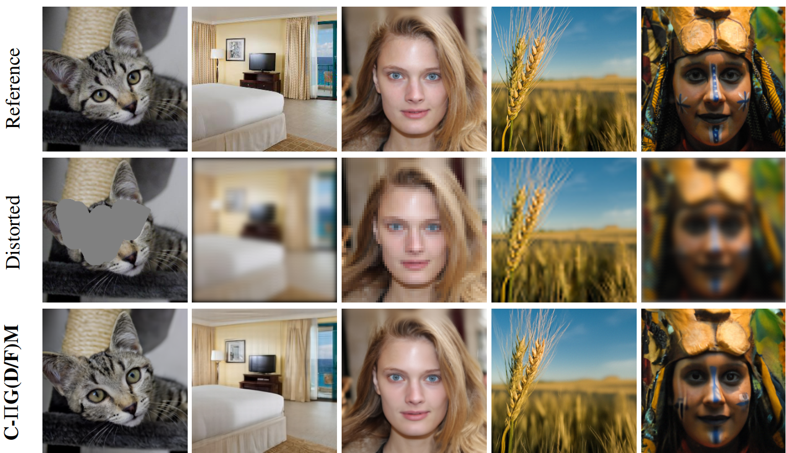

<h1 align="center">Conjugate Pseudo-Inverse Guidance <br><br> NeurIPS'24</p></h1>

<div align="center">
  <a href="https://kpandey008.github.io/" target="_blank">Kushagra&nbsp;Pandey*</a> &emsp; <b>&middot;</b> &emsp; <a href="https://buggyyang.github.io/" target="_blank">Ruihan&nbsp;Yang*</a> &emsp;<b>&middot;</b> &emsp;
  <a href="https://www.stephanmandt.com/" target="_blank">Stephan&nbsp;Mandt</a> 
</div>
<br>

Official Implementation of the paper: <a href='https://arxiv.org/abs/2405.17673'>Fast Samplers for Inverse Problems in Iterative Refinement Models </a>

## Overview
<center>

</center>

We propose a method for fast sampler based on Conjugate Integrators for solving inverse problems using pretrained diffusion or flow models. Also see our official [project page](https://mandt-lab.github.io/c-pigdm/) for qualitative results.

## Code Setup

This repo builds on top of the official [RED-Diff](https://github.com/NVlabs/RED-diff) implementation. Please clone the repo with `c-pigdm` as the working directory for downstream tasks like setting up the dependencies, and inference.

## Dependency Setup

Our `requirements.txt` file can be used to setup a conda environment directly using the following command:

```
conda create --name <env> --file requirements.txt
```

## Setting up Pretrained Checkpoints
In this work we use pretrained unconditional ImageNet checkpoints from the [ADM](https://github.com/openai/guided-diffusion) repository. We use an pretrained unconditional FFHQ checkpoint from the [DPS](https://github.com/DPS2022/diffusion-posterior-sampling) repository 

## Config Management
Config management is done using Hydra configs. All configs can be found in the directory `_configs/` with algorithm specific config in the `_configs/algo` directory.

## Inference

 We include a sample inference script used in this work in the directory `test_scripts/test.sh`. For instance, using the noiseless linear Conjugate $\Pi$-GDM for a 4x super-resolution task using 5 sampling steps can be performed using the following command:

```shell script
samples_root=demo_samples/
exp_root=/home/pandeyk1/ciip_results/
ckpt_root=/home/pandeyk1/ciip_results/pretrained_chkpts/adm/
save_deg=True
save_ori=True
overwrite=True
smoke_test=1 # Controls the number of batches generated
batch_size=1


python main.py \
        diffusion=vpsde \
        classifier=none \
        algo=cpgdm \
        algo.lam=0 \
        algo.w=15.0 \
        algo.deg=bicubic4 \
        algo.num_eps=1e-6 \
        algo.denoise=False \
        loader=imagenet256_ddrmpp \
        loader.batch_size=$batch_size \
        loader.num_workers=2 \
        dist.num_processes_per_node=1 \
        exp.name=debug \
        exp.num_steps=5 \
        exp.seed=0 \
        exp.stride=uniform \
        exp.t_start=0.6 \
        exp.t_end=0.999 \
        exp.root=$exp_root \
        exp.name=demo \
        exp.ckpt_root=$ckpt_root \
        exp.samples_root=$samples_root \
        exp.overwrite=True \
        exp.save_ori=$save_ori \
        exp.save_deg=$save_deg \
        exp.smoke_test=$smoke_test
```
## TODOs
- Integrate the Conjugate Integrators for Flows

## Citation
If you find the code useful for your research, please consider citing our paper:

```bib
@misc{pandey2024fastsamplersinverseproblems,
      title={Fast Samplers for Inverse Problems in Iterative Refinement Models}, 
      author={Kushagra Pandey and Ruihan Yang and Stephan Mandt},
      year={2024},
      eprint={2405.17673},
      archivePrefix={arXiv},
      primaryClass={cs.CV},
      url={https://arxiv.org/abs/2405.17673}, 
}
```
